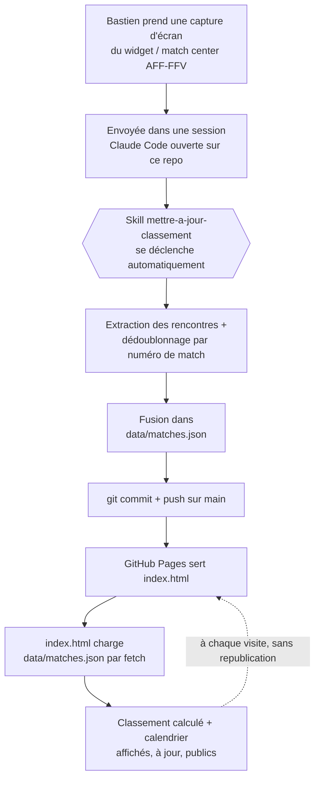

# D9-Chatel

Calendrier et classement calculé du Groupe 8 (Juniors D-9, AFF-FFV) pour
Team Veveyse (5014) c.

**Dashboard publié** : https://vastiben.github.io/D9-Chatel/

## Architecture

Une seule donnée source (`data/matches.json`), une seule page qui la lit
(`index.html`), une seule skill qui la met à jour. Rien d'autre à
synchroniser.

## Skills et agents créés pour ce projet

- **1 skill** : `.claude/skills/mettre-a-jour-classement/` — décrite plus
  bas. Se déclenche seule dès qu'une capture d'écran arrive dans une
  session ouverte sur ce repo.
- **0 agent** : le flux (extraire → dédupliquer → fusionner → pousser) est
  une seule séquence sans étape parallélisable ni besoin d'isolation — une
  skill suffit, un agent séparé n'aurait rien apporté.

## Historique — comment on est arrivés là

Deux architectures essayées puis abandonnées avant celle-ci, chacune
documentée dans son ADR :

1. **Artifact Claude auto-actualisé** (ADR-0002) : la page lisait une
   capture et se republiait elle-même. Abandonné : incompatible avec le
   partage public (aucune capacité runtime n'est autorisée sur un artifact
   public).
2. **Artifact Claude statique** (ADR-0003) : plus de mise à jour depuis la
   page, mais un artifact public s'est révélé **figé sur une version
   précise** dès le premier partage, sans moyen de le faire suivre la
   dernière version tout en restant public. Repéré en pratique : la femme
   de Bastien voyait une version obsolète dès sa toute première ouverture
   du lien.
3. **GitHub Pages** (ADR-0004, actuelle) : plus de version à figer, plus
   de lien à refaire — voir le schéma ci-dessus.

Détail complet de chaque décision dans `docs/adr/`.

## Structure

- `index.html` — la page, hébergée par GitHub Pages (voir ADR-0004). Charge
  `data/matches.json` par un simple `fetch` relatif à chaque visite — pas
  de copie des données à maintenir dans la page.
- `data/matches.json` — la seule source de vérité des données.
- `CONTEXT.md` — vocabulaire du domaine et portée du projet.
- `docs/adr/` — décisions structurantes : ADR-0001 (calcul du classement,
  saisie manuelle), ADR-0002 et ADR-0003 (mise à jour depuis un Artifact
  Claude — tentée puis abandonnée), ADR-0004 (hébergement GitHub Pages).
- `.claude/skills/mettre-a-jour-classement/` — la skill qui traite les
  captures d'écran envoyées par Bastien et met à jour les données.

## Mettre à jour le dashboard

Envoyer à une session Claude Code ouverte sur ce repo une ou plusieurs
captures d'écran du widget ou du match center AFF-FFV pour le Groupe 8 —
en vrac, chevauchements entre captures inclus. La skill
`mettre-a-jour-classement` se déclenche automatiquement, met à jour
`data/matches.json` et pousse sur `main` — la page se met à jour toute
seule à la prochaine visite, aucune republication à faire.

## Pourquoi c'est manuel

L'accès automatisé au match center et au widget de l'ASF/SFV est
explicitement interdit par la fédération (message de blocage renvoyant
vers `clubservices@football.ch`). Ce projet ne le contourne pas — voir
`CONTEXT.md` § Source des données.
